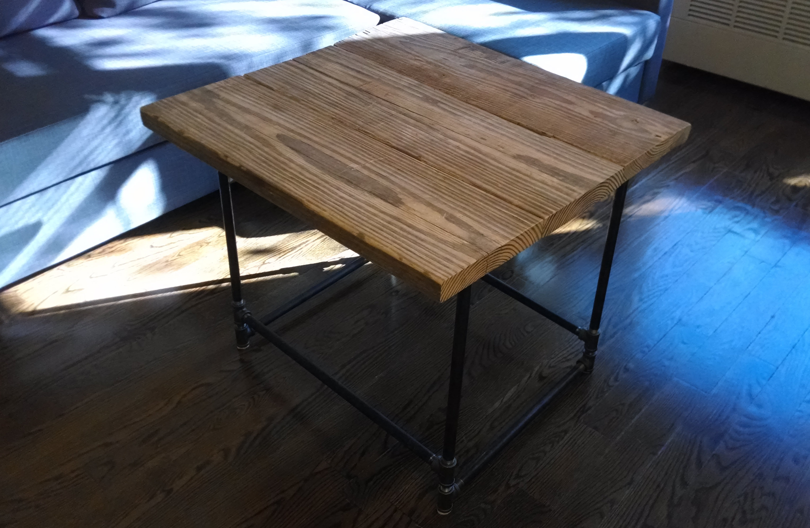
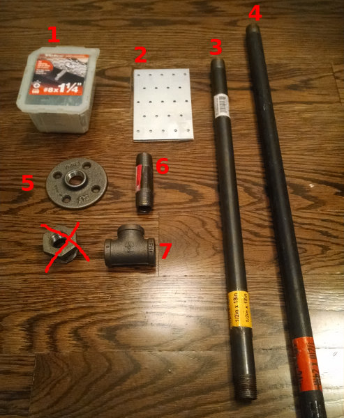
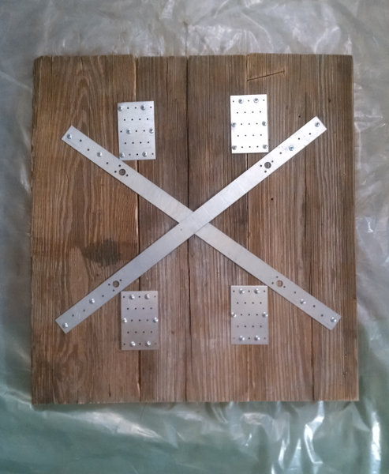
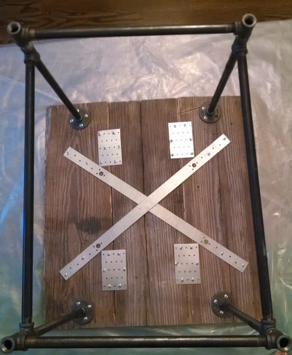

# Rustic Wood + Pipes Table

## Materials

- Wood planks (x2-3, depending on size)
- Drill Screws
- Steel Plates (x6-9, depending on size)
- 1/2"x18" Pipes
- 1/2"x1' Pipes
- Floor Flanges (x4 or x8, depending on model)
- 1/2" Nipples (x4)
- Tees (x8-x6, depending on model)

## Process

###Tabletop

Fix one plank to another using the steel plates and the screws (different approaches might be needed depending on the size of the planks and the plates)

### Legs

Play around with the legs until you find a model you like. Once you get them, use them to measure where to atach the floor flanges to the wood, in order to fixate the legs

TODO: Show diagrams of different legs

## Gotchas

- Build the legs BEFORE attaching the flanges
- Tees, nipples and flanges add up, so consider that when estimating the height of the table