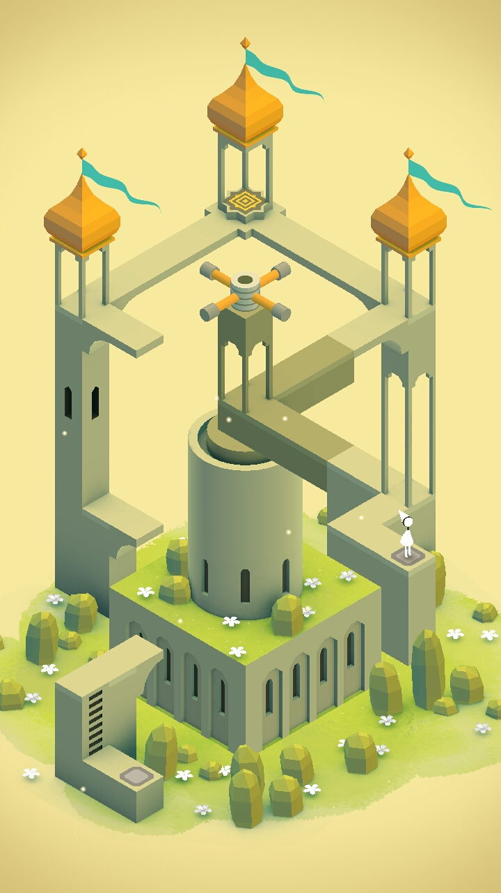
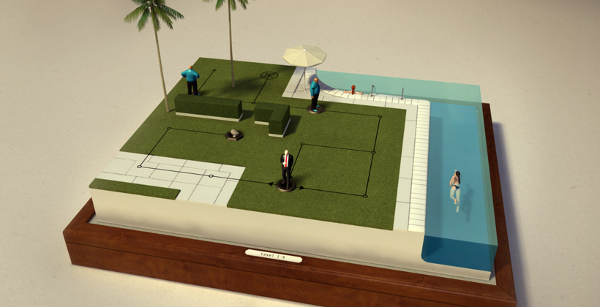
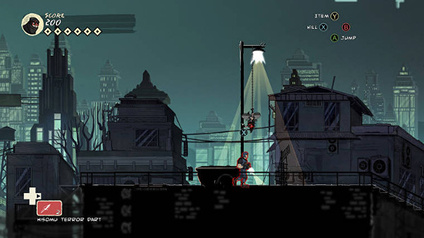
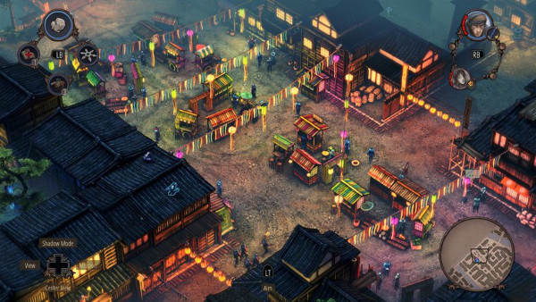
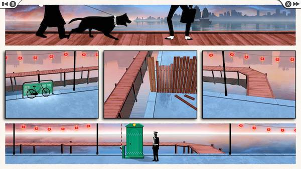

# Games

- [Monument Valley](https://play.google.com/store/apps/details?id=com.ustwo.monumentvalley): Rather short and not challenging at all, but both the music and graphics are awesome (having and Escherian inspiration is a plus)

- [Hitman GO](https://play.google.com/store/apps/details?id=com.squareenixmontreal.hitmango): A lot of Hitman-style missions, in a turn-based strategy game. Having to play each level more than once to get all objectives is a bit boring, but I can live with that. (There are Lara Croft and a Deus Ex versions of this game, with slightly different game mechanics)

- [Mark of the Ninja](https://www.kleientertainment.com/games/mark-ninja): Stealth plataformer with a super cool background story.

- [Shadow Tactics: Blades of the Shogun](http://www.shadow-tactics.com): Stealth-oriented real-time tactics... if you played Commandos, Desperados or games like that and you liked them, you'll loe this: a gem of the (not so populated) genre.

- [FRAMED Collection](http://framed-game.com/): Unique gameplay where you have to change the order of the panels of a comic to make the scene flow to the desired end.

